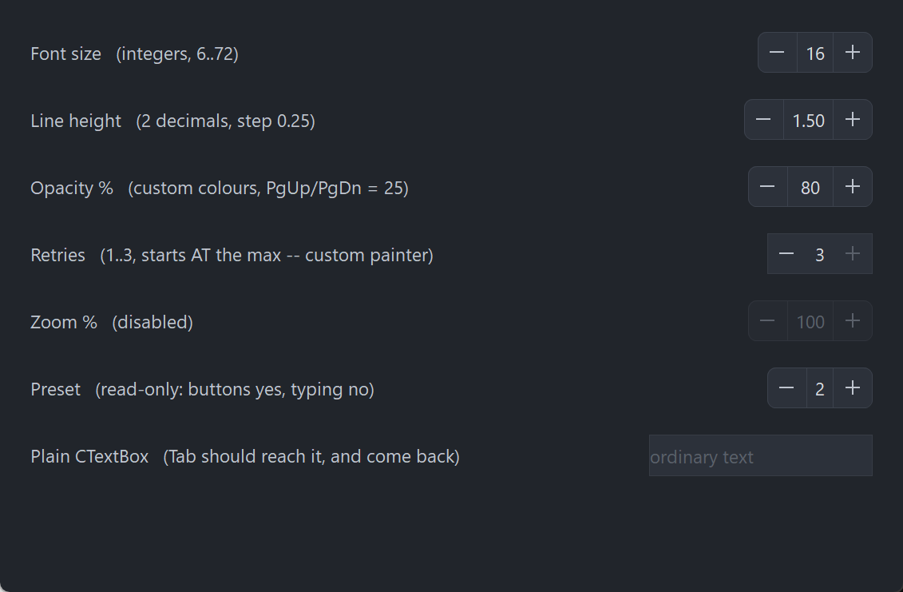

# PsNumericUpDown

An owner-drawn numeric up/down control — a spinner — for FreeBASIC Win32 applications: a
rounded frame holding a `−` button, an editable numeric field and a `+` button, separated by
hairline dividers.

It is the control you reach for in a settings row, where the user picks a number and either
nudges it a step at a time or types it outright. The value has a range, a settable number of
decimal places and a settable increment; the buttons auto-repeat while held, the arrow keys,
PgUp/PgDn and the mouse wheel all step it, and everything it draws is a colour you can set.
There is no system control underneath the chrome, so nothing about its appearance depends on
the visual style the user happens to be running.

The field in the middle is a real editing control — a `PsTextBox` in numeric mode, whose own
child is a RichEdit. Typing, selection, the clipboard, paste validation, undo and the
right-click menu all come from there rather than being reimplemented. That is what makes this
control cheap to use, and it is what gives it the two obligations in the next section: three
extra pairs of files, and one line in your message pump.

The control has no caption. It draws only the frame, the two buttons and the number, so a
label goes beside it, positioned by you.

---

## What it looks like



Seven rows: integers, two decimals with a 0.25 step, custom colours, a host-painted one sitting at its maximum so `+` paints disabled, a fully disabled one, a read-only one that still steps from its buttons, and a plain `PsTextBox` at the bottom that exists to prove Tab reaches past the spinner and comes back. The value field is a `PsTextBox` in numeric mode, so focus lives two levels down — `GetFocus() = hCtrl` is never true.

---

## Requirements

**Files to copy into your project:**

| File | Purpose |
|---|---|
| `PsNumericUpDown.bi` | Declarations — types, callbacks, constants, function prototypes |
| `PsNumericUpDown.inc` | Implementation |
| `PsTextBox.bi` | The editing control used as the value field |
| `PsTextBox.inc` | Its implementation |
| `PsPopupMenu.bi` | The value field's right-click menu |
| `PsPopupMenu.inc` | Its implementation |
| `PsBufferPaint.bi` | The flicker-free drawing surface everything paints through |
| `PsBufferPaint.inc` | Its implementation |

An application that already hosts `PsTextBox` or `PsPopupMenu` has those files once already —
they are the same files, and `#include once` means nothing is duplicated.

**AfxNova is required.** The control is built on `CWindow`, `PsTextBox` uses
`AfxNova\AfxRichEdit.inc`, and `CBufferPaint` draws through `AfxNova\CGdiPlus.inc`. Sources
include AfxNova relative to the workspace root (`#include once "AfxNova\CWindow.inc"`), so
builds need the workspace root on the include path:

```bash
fbc64.exe -i "C:\dev" main.bas
```

**Include order.** Each `.bi` pulls in what it needs, but the four implementation files must be
included bottom-up:

```freebasic
#include once "PsBufferPaint.inc"
#include once "PsPopupMenu.inc"
#include once "PsTextBox.inc"
#include once "PsNumericUpDown.inc"
```

**GDI+ must be running before the first repaint and must outlive the last one.** The control
renders all of its geometry through GDI+, so bracket your message loop:

```freebasic
dim as ULONG_PTR gdipToken = AfxGdipInit()
' ... create windows, run the message loop ...
AfxGdipShutdown( gdipToken )
```

`AfxGdipShutdown` must come after every window is destroyed, because each repaint builds and
tears down a `PsBufferPaint`.

**Never name an identifier `ok`.** GDI+ defines `Ok = 0` as a `Status` enum value in namespace
`AfxNova`, and hosts customarily say `using AfxNova`. An existing variable, parameter or
function called `ok` becomes a duplicate definition the moment you adopt these files. Use
`bOK` instead.

### The pump call is mandatory

**`PsNumericUpDown_FilterMessage` is not optional.** The value field carries `PsTextBox`'s
built-in Cut / Copy / Paste / Select All right-click menu, which is a `PsPopupMenu` and
therefore not modal: its keyboard navigation and its dismissal on an outside click both live in
a message filter.

```freebasic
do while GetMessage( @uMsg, null, 0, 0 )
    if uMsg.message = WM_QUIT then exit do

    if PsNumericUpDown_FilterMessage( @uMsg ) then continue do

    TranslateMessage @uMsg
    DispatchMessage @uMsg
loop
```

Leave it out and the context menu still opens and still paints, but it cannot be driven from
the keyboard and it never closes when the user clicks elsewhere. The function forwards to
`PsTextBox_FilterMessage`, so an application already calling that one is covered either way and
calling both is harmless.

### Tab navigation needs nothing from you

The control is focusable, and **Tab works without `IsDialogMessage` in your pump.** `PsTextBox`
handles `VK_TAB` itself, walking `GetAncestor( GA_ROOT )` and `GetNextDlgTabItem` to move the
focus on. A host that does run `IsDialogMessage` is fine too — the two do not fight.

What that walk needs is `WS_EX_CONTROLPARENT` on every window between the RichEdit and the
top-level window. The container sets it on itself, which is the only reason tabbing works
through the extra nesting level this control adds. Do not clear it.

---

## Quick start

```freebasic
' Create it. The control is created zero-sized and hidden.
dim as HWND hSpin = PsNumericUpDown_Create( hWndParent, IDC_MYFORM_LINEHEIGHT )
PsNumericUpDown_SetFont( hSpin, ghFont(GUIFONT_10) )

' Be told when the user changes the value.
PsNumericUpDown_SetValueChangedCallback( hSpin, @MySpin_ValueChanged )

' Shape the value. Every one of these is silent — none fires the callback above.
' Set the decimal places and the range BEFORE the value: both of them rewrite
' whatever is already there.
PsNumericUpDown_SetDecimalPlaces( hSpin, 2 )
PsNumericUpDown_SetRange( hSpin, 0.5, 3.0 )
PsNumericUpDown_SetIncrement( hSpin, 0.25 )        ' buttons, arrows, one wheel notch
PsNumericUpDown_SetLargeIncrement( hSpin, 1.0 )    ' PgUp / PgDn
PsNumericUpDown_SetValue( hSpin, 1.5 )

' Ask how big it wants to be, then place it. GetIdealSize is valid immediately,
' before the control has ever been sized.
dim as long iw, ih
PsNumericUpDown_GetIdealSize( hSpin, iw, ih )
SetWindowPos( hSpin, 0, x, y, iw, ih, SWP_NOZORDER )

ShowWindow( hSpin, SW_SHOW )
```

And the callback:

```freebasic
sub MySpin_ValueChanged( byval hCtrl as HWND, byval nValue as double )
    ' Fired only for user action. The value is already clamped, snapped and
    ' displayed, so PsNumericUpDown_GetValue( hCtrl ) = nValue.
    gConfig.LineHeight = nValue
end sub
```

That, plus the `PsNumericUpDown_FilterMessage` line in your pump, is the whole minimum.
Everything below is refinement.

---

## Concepts

### The handle is a real HWND

`PsNumericUpDown_Create` returns an ordinary window handle, and every `PsNumericUpDown_*`
function takes it. It is not an opaque type, so you can treat the control as the window it is —
`SetWindowPos` to place and size it, `ShowWindow` to show it, `GetDlgItem` to find it by the
`CtrlID` you passed at creation.

### It is created zero-sized and hidden

`PsNumericUpDown_Create` gives the container the styles `WS_CHILD`, `WS_CLIPSIBLINGS` and
`WS_CLIPCHILDREN`, plus the extended style `WS_EX_CONTROLPARENT`. `WS_VISIBLE` is deliberately
absent, so a newly created control shows nothing until you size it and call `ShowWindow`. That
lets you build and configure a control before it is ever seen.

The container itself is **not** a tabstop; the RichEdit inside it is.

### The value field is an embedded PsTextBox

The window tree is three deep:

```
PsNumericUpDown container      WS_EX_CONTROLPARENT
  +-- PsTextBox                borderless: this control owns all the chrome
        +-- RichEdit50W       WS_TABSTOP — the real focus target
```

The `PsTextBox` is created borderless, in numeric mode, centred, with its margins taken from the
value padding and with "an empty buffer reads as zero" turned on.
`PsNumericUpDown_GetTextBoxHandle` is the escape hatch: every `PsTextBox_*` setter applies to it —
cue banner, text limit, context-menu theming, and so on.

**Three `PsTextBox` setters are owned by this control and must not be set behind its back:**

| Setter | Why not |
|---|---|
| `PsTextBox_SetValue` | Use `PsNumericUpDown_SetValue`, or the committed value and the buttons' at-a-limit state go stale |
| `PsTextBox_SetDecimalPlaces` | Use `PsNumericUpDown_SetDecimalPlaces`, for the same reason |
| `PsTextBox_SetBorderWidth` | Anything nonzero draws a second frame inside this control's own |

### Focus lives two levels down

**`GetFocus() = hCtrl` is never true.** Keyboard focus sits on the RichEdit, two windows below
the handle you hold, so the obvious test always answers FALSE. Use
`PsNumericUpDown_HasFocus( hCtrl )`, which asks the right window.

`SetFocus( hCtrl )` does work and means what you expect — the container hands the focus straight
down to the RichEdit rather than swallowing it.

Focus is shown by recolouring the frame in `FocusBorderColor`. There is no separate focus ring
and therefore no reserved ring band, so **the control's ideal size does not change when focus
arrives** and nothing shifts sideways when you Tab onto it.

Arriving by Tab selects the whole number, so the first keystroke replaces it. Arriving by
clicking a button deliberately does not, so the number is not left highlighted after every click
of `+`.

### Geometry is derived, never assigned

The control computes nine rectangles and owns all nine. You influence them through the layout
setters; you never write them.

```
  rcFrame  = the whole client (the rounded border is stroked INSIDE it, over the cells)

  rcMinus  = client.left ..                  client.left + buttonWidth
  rcDiv1   = rcMinus.right ..                + dividerThickness
  rcPlus   = client.right - buttonWidth ..   client.right
  rcDiv2   = rcPlus.left - dividerThickness .. rcPlus.left
  rcValue  = rcDiv1.right .. rcDiv2.left,    inset top and bottom by borderThickness

  rcMinusBar = glyphLength    x glyphThickness, centred in rcMinus
  rcPlusBarH = glyphLength    x glyphThickness, centred in rcPlus
  rcPlusBarV = glyphThickness x glyphLength,    centred in rcPlus
```

Two things in there are worth knowing before you write a paint callback:

**The cells are not deflated by the border.** The button cells span the full client height and
reach the client edge, and the frame's outline is stroked over their outer edges last. A cell
inset by the border width would round its own corners a pixel inside the frame's, leaving a
sliver of the base fill showing through whenever a hovered button's colour differs from it.

**`rcValue` alone is inset, and only vertically, by exactly the border thickness.** It is the
one rect a child window covers: the `PsTextBox` sits exactly on it and paints its own background
there, so a full-height value cell would put the child on top of the frame's top and bottom rows
and the border would be interrupted across the middle of the control.

Both `+` bars are centred on the same cell centre rather than one being derived from the other,
so the cross is exactly symmetric whatever the parity of the cell and the bar.

Layout is lazy. A setter marks the layout stale and asks for a repaint; the next paint — or any
rect query — recomputes it. There is no begin-update / end-update pair to remember, and setting
six properties in a row costs one layout pass, not six.

Laying out takes no device context. Nothing in the cells is measured — every number is either
authored or derived from the client rect, and the number on screen is measured by the RichEdit.
`PsNumericUpDown_GetIdealSize` is the one place this control measures anything, and it opens its
own DC to do it.

### The ideal size is measured from the range

`PsNumericUpDown_GetIdealSize` formats **both ends of the range** at the current decimal places,
measures them in the current font, takes the wider, and adds the padding, both buttons, both
dividers and the border:

```
  width  = 2*buttonWidth + 2*dividerThickness + padLeft + padRight + widestValueText
  height = fontHeight + 2*vertPadding + 2*borderThickness
```

Both ends, because `-1000` is wider than `999` and a range that never goes negative should not
pay for a minus sign it will never draw. Because it measures rather than consulting the layout,
it is **valid before the control has ever been sized** — which is exactly when a host calls it.

### Pixels, and who scales them

Only the creation-time defaults are DPI-scaled for you:

| Setting | Default | DPI-scaled at create? |
|---|---:|---|
| Button width | 28 | Yes |
| Value padding, left and right | 6 | Yes |
| Vertical padding | 5 | Yes |
| Corner radius | 6 | Yes |
| Glyph length | 10 | Yes |
| Glyph thickness | 1 | **Yes** |
| Border thickness | 1 | **No** |
| Divider thickness | 1 | **No** |

Every setter afterwards takes raw pixels and expects **you** to scale — typically
`pWindow->ScaleX(...)` / `ScaleY(...)`.

**The glyph thickness is scaled and the two hairlines are not, and the asymmetry is
deliberate.** The border and the divider are *rules*, and a rule that thickens with the display
stops reading as a rule. The bars of the `−` and the `+` are not rules, they are the strokes of
an *icon*: scale an icon's length but not its weight and it grows thinner relative to itself at
every step up in DPI, until the minus sign reads as a thread rather than a glyph.

### Stepping, clamping and the decimal grid

Every step — button, arrow key, PgUp/PgDn, wheel, `StepUp`/`StepDown`, `SetValue` — goes through
the same two operations, in this order:

1. **Snapped to the decimal grid**, not merely rounded for display. Adding `0.1` ten times to a
   binary double lands on `0.9999999999999999`, and a value a hair below the grid formats
   correctly while comparing wrong — so the drift would stay invisible until a range check at a
   limit disagreed with the number on screen.
2. **Clamped into `[min, max]`. The range clamps; it never wraps.** A button that can no longer
   move the value paints disabled while the rest of the control stays live.

A step starts from **what is in the field**, not from the last committed value, so typing `50`
and then clicking `+` gives you `51`. Out-of-range typed text is clamped on the way in, so a
step always starts from a legal value.

### Who notifies, and when

This is the part most worth reading twice. The change callback reports **user** action only, and
the timing differs by input:

| Input | When `ValueChangedCallback` fires |
|---|---|
| `−` or `+` button click | Immediately — the step happens on the button-**down** |
| Auto-repeat tick | Immediately, once per step |
| Up / Down arrow in the field | Immediately |
| PgUp / PgDn in the field | Immediately |
| Mouse wheel | Immediately, once accumulated deltas complete a whole notch |
| Typing | **On commit only** — ENTER, or focus leaving the field |
| `SetValue`, `SetRange`, `SetDecimalPlaces`, `StepUp`, `StepDown` | **Never** |

Typing `16` therefore never reports the transient `1`. Commit is also when the typed text is
clamped, snapped and reformatted, which is what turns `5.` into `5.00`.

Because every programmatic setter is silent, it is safe to call one from inside your own change
handler without recursing. This follows Win32's own `BM_SETCHECK` / `BN_CLICKED` split.

`PsNumericUpDown_GetValue` returns the **committed** value. While the user is mid-typing it still
reports the last committed number, and so does the buttons' at-a-limit appearance — they still
*step* correctly from what was typed.

### How a button press works

**The value steps on the button-down, not on the release.** It has to: auto-repeat must start
from somewhere, and a first step deferred to the release would arrive after the repeats it
precedes. Every real spinner behaves this way, and it means **sliding off a button does not undo
the step that already happened.**

The control takes mouse capture for the press anyway, and what capture buys here is the repeat,
not a press/cancel gesture:

- the repeat stops the moment the cursor leaves the button, and resumes — after the full delay
  again, so a wobbling cursor cannot machine-gun the value — if it comes back;
- the up-message is guaranteed to arrive, wherever the cursor has wandered to, so the repeat
  timer can never outlive the gesture.

Repeating starts after `nDelayMs` and then ticks every `nIntervalMs`. **It stops dead when the
value reaches a limit** rather than spinning against the clamp. Either timing value at or below
zero disables repeating entirely: one click, one step.

### The wheel steps by one increment per notch

Sub-notch deltas accumulate, so a slow precision-touchpad swipe is not truncated away to
nothing. `SPI_GETWHEELSCROLLLINES` is deliberately **not** consulted — "how many lines does one
notch scroll" is a question about scrolling a view, and this is a value, not a view. One notch
is one increment, and you control the feel through `PsNumericUpDown_SetIncrement`.

Wheel messages go to the *focused* window, so most of them arrive at the RichEdit. The container
catches the other case: Windows' "scroll inactive windows" setting, on by default, delivers the
wheel to whatever is under the cursor, which is the container when the pointer is over a button.

### Enabling, disabling and read-only

They are different statements, and both are available.

`PsNumericUpDown_SetEnabled( hCtrl, false )` calls `EnableWindow` on **both** the container and
the `PsTextBox`. A disabled window receives no mouse input at all, and disabling only the
container would leave the field itself enabled, where a programmatic `SetFocus` could still drop
a caret into a control that looks dead. If you call `EnableWindow` on the control directly, the
control notices and greys itself, so the two routes cannot disagree.

`PsNumericUpDown_SetReadOnly( hCtrl, true )` stops **typing only**. The buttons, the arrow keys,
PgUp/PgDn and the wheel all keep working. It says "you may not type an arbitrary number here",
which is not the same as "this control is inert".

### Lifetime

The control frees itself when its window is destroyed, taking the `PsTextBox` with it. It owns no
host resources — in particular the font is caller-owned and is never deleted. Destroy the parent
and you are done.

---

## Behaviour and limits

Firm properties of the control, not settings:

- **The pump call is mandatory.** Without `PsNumericUpDown_FilterMessage`, the value field's
  right-click menu has no keyboard navigation and never closes on an outside click.
- **`GetFocus() = hCtrl` is never true.** Focus lives on the RichEdit two levels down; use
  `PsNumericUpDown_HasFocus`.
- **`WS_EX_CONTROLPARENT` on the container is load-bearing.** `PsTextBox`'s own `VK_TAB` walk
  only sees through a container that declares itself one, so clearing it breaks tabbing into and
  out of the value field.
- **The range clamps; it never wraps.** A button at a limit paints disabled, and auto-repeat
  stops there.
- **Every step snaps to the decimal grid**, not just on display.
- **The control can never be blank.** With a range there is no "no value" state to represent, so
  an empty field reads as zero and is then clamped.
- **The step happens on the button-down.** Pressing a button and sliding off before releasing
  does not undo it.
- **Double-clicks are not special.** `CS_DBLCLKS` is deliberately off, so a rapid second click
  arrives as an ordinary down/up pair and steps again. With it on, the second of two rapid
  clicks would arrive as `WM_LBUTTONDBLCLK` and a user double-clicking `+` to add two would get
  one.
- **Home and End are not claimed.** They move the caret to the start and end of the text.
  Stealing them for min/max would break ordinary editing in a field the user can type into.
- **The value cell is reported by `HitTest` but never acted on.** That area is covered by the
  `PsTextBox` child, which receives its own mouse messages and never routes them to the
  container, so in practice only `NUD_PART_MINUS` and `NUD_PART_PLUS` are reachable through a
  real mouse message.
- **No tooltip support.** There is no tooltip callback and no tooltip window is created. If you
  want a tip, add your own tool over the control's `HWND`.
- **The right mouse button is reported by the container, never acted on.** The value field has
  its own context menu; the buttons have none, and inventing one is your business. No capture is
  taken for the right button, so a right-up can arrive without a matching down.
- **When the control is too narrow for both buttons and both dividers, the value cell collapses
  to zero width and the buttons keep their size, clipping at the client edge.** Rects are
  computed honestly rather than squeezed, so the buttons stay square and only what is past the
  edge is lost. `rcValue` is never allowed to invert, and a collapsed value cell hides the child
  rather than handing it a degenerate rect.
- **A paint callback replaces the frame, the cells, the dividers and the glyphs — never the
  number.** The RichEdit paints that over `rcValue` afterwards, whatever the callback drew
  there, and `WS_CLIPCHILDREN` keeps the child's rect out of the callback's DC anyway.
- **A primitive that fills a rect covering the whole control erases everything under it.** See
  the warning under [Paint](#paint).

---

## API reference

### Creation

| Function | Description |
|---|---|
| `PsNumericUpDown_Create( hWndParent, CtrlID ) as HWND` | Creates the control as a child of `hWndParent` and returns its window handle. `CtrlID` becomes the window's `GWLP_ID`, so `GetDlgItem` finds it. Created zero-sized and hidden — size it with `PsNumericUpDown_GetIdealSize`, place it with `SetWindowPos`, then `ShowWindow`. |
| `PsNumericUpDown_HasFocus( hCtrl ) as boolean` | TRUE while the value field owns the keyboard focus. **Use this, not `GetFocus`** — focus sits on the RichEdit two levels down, so `GetFocus() = hCtrl` is always FALSE. |
| `PsNumericUpDown_GetEnabled( hCtrl ) as boolean` | The control's enabled state. |
| `PsNumericUpDown_SetEnabled( hCtrl, isEnabled )` | Enables or disables through `EnableWindow`, on the container **and** on the embedded `PsTextBox`, so input really stops and no `SetFocus` can sneak in. Disabling clears any hover and cancels a live press and its repeat. Does not change the value. |
| `PsNumericUpDown_Refresh( hCtrl )` | Marks the layout stale, requests a repaint with background erase, and re-places the child. Rarely needed — every setter does this for you. |
| `PsNumericUpDown_FilterMessage( pMsg as MSG ptr ) as boolean` | **Call this in your message pump.** Returns TRUE when the message was consumed by the value field's context menu, in which case skip `TranslateMessage`/`DispatchMessage` for it. Forwards to `PsTextBox_FilterMessage`, so calling both is harmless. |

### Value and range

Every setter here is **silent** — none fires the change callback.

| Function | Description |
|---|---|
| `PsNumericUpDown_GetValue( hCtrl ) as double` | The **committed** value. While the user is mid-typing this is still the last committed number. |
| `PsNumericUpDown_SetValue( hCtrl, nValue )` | Snaps to the decimal grid, clamps into the range, displays it and records it. What you set is what `GetValue` returns and what is on screen. |
| `PsNumericUpDown_GetRange( hCtrl, byref nMin, byref nMax )` | The current range. |
| `PsNumericUpDown_SetRange( hCtrl, nMin, nMax )` | Sets the range. **An inverted pair is swapped, not rejected** — the alternative is a control whose clamp can never be satisfied and that pins to the minimum on every step. Re-clamps the current value, silently. |
| `PsNumericUpDown_GetDecimalPlaces( hCtrl ) as long` | Digits after the decimal point; `0` means integers only. |
| `PsNumericUpDown_SetDecimalPlaces( hCtrl, nPlaces )` | Sets the grid the value snaps to and the format it displays in. A negative count is floored at 0. Re-snaps the current value onto the new grid, silently — `16.25` at 2 places becomes `16` at 0. Reaches the embedded `PsTextBox` too, which is what makes the field **refuse a typed decimal separator outright at 0 places**. |

Set the decimal places and the range **before** the value: each of them rewrites whatever is
already there.

### Stepping

| Function | Description |
|---|---|
| `PsNumericUpDown_GetIncrement( hCtrl ) as double` | The step used by the buttons, the Up/Down arrows and one wheel notch. Default 1. |
| `PsNumericUpDown_SetIncrement( hCtrl, nIncrement )` | Sets it. **Takes the magnitude** — a negative increment is stored as its absolute value, so `−` always goes down. |
| `PsNumericUpDown_GetLargeIncrement( hCtrl ) as double` | The step used by PgUp and PgDn. Defaults to ten times the increment default. |
| `PsNumericUpDown_SetLargeIncrement( hCtrl, nIncrement )` | Sets it; also takes the magnitude. |
| `PsNumericUpDown_StepUp( hCtrl )` | Adds one increment to whatever is in the field, snapped and clamped. The programmatic door to exactly what the `+` button does — **minus the notification**. |
| `PsNumericUpDown_StepDown( hCtrl )` | The same, downwards. Also silent. |
| `PsNumericUpDown_GetAutoRepeat( hCtrl, byref nDelayMs, byref nIntervalMs )` | The hold-to-repeat timings, in milliseconds. Defaults 400 and 60. |
| `PsNumericUpDown_SetAutoRepeat( hCtrl, nDelayMs, nIntervalMs )` | Sets them. **Either value at or below zero disables repeating** (one click, one step) and stops any repeat already running. Repeating also stops on its own the moment the value reaches a limit. |

### The value field

| Function | Description |
|---|---|
| `PsNumericUpDown_GetTextBoxHandle( hCtrl ) as HWND` | The embedded `PsTextBox`, so any `PsTextBox_*` setter can be applied to it — cue banner, text limit, context-menu theming. **Do not call `PsTextBox_SetValue`, `PsTextBox_SetDecimalPlaces` or `PsTextBox_SetBorderWidth` on it**: the first two go stale against this control's committed value, and the third draws a second frame inside this one's. |
| `PsNumericUpDown_GetReadOnly( hCtrl ) as boolean` | TRUE when typing is blocked. |
| `PsNumericUpDown_SetReadOnly( hCtrl, bReadOnly )` | Blocks **typing only**. The buttons, the arrow keys, PgUp/PgDn and the wheel keep working. For a genuinely inert control use `PsNumericUpDown_SetEnabled`. |
| `PsNumericUpDown_GetFont( hCtrl ) as HFONT` | The font the value is drawn in. |
| `PsNumericUpDown_SetFont( hCtrl, hFont )` | Hands the font to the `PsTextBox` and re-lays-out. **Caller-owned** — the control converts nothing and deletes nothing, so you keep ownership of the `HFONT` and must free it yourself. This font is also what `GetIdealSize` measures in; with none set it measures in `DEFAULT_GUI_FONT`. |

### Geometry and layout

All setters take **raw pixels**; you do the DPI scaling. Each marks the layout stale and requests
a repaint.

| Function | Description |
|---|---|
| `PsNumericUpDown_GetButtonWidth( hCtrl ) as long` | The width of each of the two button cells. |
| `PsNumericUpDown_SetButtonWidth( hCtrl, nWidth )` | Sets it; clamped to a minimum of 0. Both buttons share one width. |
| `PsNumericUpDown_GetValuePadding( hCtrl, byref nLeft, byref nRight, byref nVert )` | The text margins inside the value cell, and the vertical padding. |
| `PsNumericUpDown_SetValuePadding( hCtrl, nLeft, nRight, nVert )` | Each clamped to a minimum of 0. `nLeft`/`nRight` are real text margins, pushed into the field. **`nVert` is used only by `GetIdealSize`**, to decide the height around one line of text — it insets nothing. |
| `PsNumericUpDown_GetCornerRadius( hCtrl ) as long` | The frame's corner radius. |
| `PsNumericUpDown_SetCornerRadius( hCtrl, nRadius )` | Sets it; clamped to a minimum of 0, where **0 gives square corners**. |
| `PsNumericUpDown_GetBorderThickness( hCtrl ) as long` | The frame outline's thickness. |
| `PsNumericUpDown_SetBorderThickness( hCtrl, nThickness )` | Sets it; clamped to a minimum of 0, where **0 means no frame at all**. This value also insets the value cell vertically, so changing it moves the child. Do not DPI-scale it. |
| `PsNumericUpDown_GetDividerThickness( hCtrl ) as long` | The hairline between each button and the value cell. |
| `PsNumericUpDown_SetDividerThickness( hCtrl, nThickness )` | Sets it; clamped to a minimum of 0, where **0 draws no dividers** — and, being zero-width, takes no space either, since the cells and dividers tile the client width exactly. Do not DPI-scale it. |
| `PsNumericUpDown_GetGlyphSize( hCtrl, byref nLength, byref nThickness )` | The bar of the `−` (and each bar of the `+`), and its stroke weight. |
| `PsNumericUpDown_SetGlyphSize( hCtrl, nLength, nThickness )` | Sets both; **each floored at 1**, so a degenerate glyph becomes a 1×1 dot rather than nothing at all. Unlike the two hairlines, this thickness **should** be DPI-scaled — it is an icon stroke. |
| `PsNumericUpDown_GetIdealSize( hCtrl, byref nWidth, byref nHeight )` | The size that fits the widest value the range can produce at the current decimal places, in the current font, plus the padding, both buttons, both dividers and the border. Measures both ends of the range. Opens its own DC, so it is **valid before the control has ever been sized**. |
| `PsNumericUpDown_GetFrameRect( hCtrl, byref rc ) as boolean` | The frame — the whole client area. |
| `PsNumericUpDown_GetMinusRect( hCtrl, byref rc ) as boolean` | The `−` button cell. Spans the full client height: the cells are not deflated by the border. |
| `PsNumericUpDown_GetValueRect( hCtrl, byref rc ) as boolean` | The value cell — where the `PsTextBox` child sits exactly. The one rect inset by the border, and only vertically. |
| `PsNumericUpDown_GetPlusRect( hCtrl, byref rc ) as boolean` | The `+` button cell. |
| `PsNumericUpDown_HitTest( hCtrl, pt ) as long` | Which `NUD_PART_*` is under a point in **client** coordinates, or `NUD_PART_NONE` outside the cells. `NUD_PART_VALUE` is reported for completeness; the control never acts on it. |

The four rect queries force any pending layout first, so their results are always current. Each
returns FALSE — leaving `rc` empty — when the control has no client area yet, which is the case
between `PsNumericUpDown_Create` and the first `SetWindowPos`.

### Appearance

| Function | Description |
|---|---|
| `PsNumericUpDown_GetColors( hCtrl, pColors as PSNUMERICUPDOWN_COLORS ptr )` | Fills your struct with the control's current colours. |
| `PsNumericUpDown_SetColors( hCtrl, pColors as PSNUMERICUPDOWN_COLORS ptr )` | Copies the whole struct in, pushes the value cell's colours into the embedded `PsTextBox`, and repaints. |

To change one colour, read-modify-write:

```freebasic
dim as PSNUMERICUPDOWN_COLORS clrs
PsNumericUpDown_GetColors( hSpin, @clrs )
clrs.ButtonBackColorHot     = BGR( 62,140, 90)
clrs.ButtonBackColorPressed = BGR( 42,100, 64)
clrs.FocusBorderColor       = BGR(120,200,150)
PsNumericUpDown_SetColors( hSpin, @clrs )
```

### Callback registration

| Function | Description |
|---|---|
| `PsNumericUpDown_SetPaintCallback( hCtrl, usersub )` | Installs a renderer that draws the frame, the cells, the dividers and the glyphs **instead of** the built-in painter. Repaints. It never draws the number. |
| `PsNumericUpDown_SetMessageCallback( hCtrl, userfunc )` | Installs an observer for the container's mouse and timer messages **and** the value field's relayed key, wheel and focus messages. |
| `PsNumericUpDown_SetValueChangedCallback( hCtrl, usersub )` | Installs the handler told when the **user** changes the value. |

All three are optional and independent.

---

## Colors

The colour surface is one flat struct, `PSNUMERICUPDOWN_COLORS`, with eighteen `COLORREF` fields.
Every field ships with a usable dark-theme default, so a control you never call
`PsNumericUpDown_SetColors` on still looks right.

| Field | Paints |
|---|---|
| `BackColor` | The control's own client area — visible only **outside** the rounded corners |
| `BorderColor` | The frame outline, idle |
| `FocusBorderColor` | The frame outline while the value field has focus |
| `BorderColorDisabled` | The frame outline when the control is disabled |
| `DividerColor` | The two hairlines, idle |
| `DividerColorDisabled` | The two hairlines when the control is disabled |
| `ValueBackColor` | The value cell's background — and the frame's base fill |
| `ValueForeColor` | The number itself |
| `ValueBackColorDisabled` | The value cell's background when disabled — and the frame's base fill |
| `ValueForeColorDisabled` | The number when disabled |
| `ButtonBackColor` | A button cell, idle |
| `ButtonBackColorHot` | A button cell, mouse over |
| `ButtonBackColorPressed` | A button cell, held down with the cursor still on it |
| `ButtonBackColorDisabled` | A button cell, disabled **or at its limit** |
| `GlyphColor` | The `−` / `+` bars, idle |
| `GlyphColorHot` | The bars, mouse over |
| `GlyphColorPressed` | The bars, pressed |
| `GlyphColorDisabled` | The bars, disabled or at the limit |

The four `Value*` fields are handed to the embedded `PsTextBox` rather than painted by this
control — the RichEdit draws the number. They live in this struct so that you set every colour
of the control in one place. They are re-applied whenever the enabled state changes.

### Which colour wins

For each button cell, the built-in painter picks one background and one glyph colour per
repaint, in this precedence:

```
disabled   >   pressed   >   hot   >   idle
```

where **disabled means either the whole control is disabled *or* this particular button is at
its limit**. A button that can no longer move the value greys itself while the rest of the
control stays live; that is the only per-part state in the renderer.

"Pressed" means held down **and** the cursor still on that button. Slide off during a press and
the button stops painting pressed — without the step being undone.

The frame outline has its own three-way precedence:

```
disabled   >   focused   >   idle
```

### Why the control reads as one flat cell at rest

`ButtonBackColor` defaults **equal to** `ValueBackColor`, so at rest the dividers are the only
thing separating the three parts and the control reads as a single rounded cell that only
sprouts buttons when you hover it. If you want visibly raised buttons, set the field.

### What the painter draws

The paint order is load-bearing, and it is what keeps the corners round:

| Step | What |
|---|---|
| 1 | The client, in `BackColor` — shows through outside the rounded corners |
| 2 | The whole frame, as a filled **round** rect in the value background colour. This is what makes the corners round, and it is also the value cell's background for the strip above and below the child |
| 3 | Each button cell, as a filled round rect **extended inward past the divider**, so its unwanted inner rounding lands somewhere harmless and only the outer, wanted rounding survives |
| 4 | The dividers and the glyphs, as filled **rectangles** — an antialiased one-pixel axis-aligned rule comes out grey and blurry, so antialiasing is reserved for curves |
| 5 | The frame **outline** last, over everything |

All of it goes through `PsBufferPaint`, which renders geometry with GDI+, so the frame's corners
are antialiased. A paint callback gets that same buffer and inherits the same primitives.

---

## Callbacks

### Value changed

```freebasic
type NUD_ValueChangedCallbackSub as sub( byval hCtrl as HWND, byval nValue as double )
```

The **user** changed the value. Fires after the value has been clamped, snapped and displayed,
so `PsNumericUpDown_GetValue( hCtrl )` already equals `nValue`.

See [Who notifies, and when](#who-notifies-and-when) for the timing table. In short: immediately
for a button, an auto-repeat tick, an arrow key, PgUp/PgDn and the wheel; on commit only for
typing; never for a programmatic setter.

That last part is what makes it safe to call `PsNumericUpDown_SetValue` from inside this handler.

### Paint

```freebasic
type NUD_PaintCallbackSub as sub( byval p as PSNUMERICUPDOWN_PAINTINFO ptr )
```

Draws the frame, the cells, the dividers and the glyphs **instead of** the built-in painter.
Paint through `p->b`, the control's double buffer for this repaint — do not touch the screen DC.

The control has already filled the client with `BackColor` before calling you, so a callback
that only wants to add something on top does not have to repaint the background.

**It does not draw the number.** The RichEdit paints that over `rcValue` afterwards, whatever
you drew there.

`PSNUMERICUPDOWN_PAINTINFO` carries everything you need:

| Field | Meaning |
|---|---|
| `hCtrl` | The control, so the callback can query it |
| `b` | The control's `PsBufferPaint` for this repaint (borrowed, not owned) |
| `rcClient` | The whole client area |
| `rcFrame` | Where the rounded border is stroked |
| `rcMinus` | The left button cell |
| `rcDiv1` | The hairline between the `−` cell and the value cell |
| `rcValue` | The value cell — the `PsTextBox` child sits exactly here |
| `rcDiv2` | The hairline between the value cell and the `+` cell |
| `rcPlus` | The right button cell |
| `rcMinusBar` | The `−` glyph |
| `rcPlusBarH` | The `+` glyph, horizontal bar |
| `rcPlusBarV` | The `+` glyph, vertical bar |
| `hotPart` | `NUD_PART_*` under the cursor, or `NUD_PART_NONE` |
| `pressedPart` | `NUD_PART_*` held down **and** the cursor still inside, or `NUD_PART_NONE` |
| `isEnabled` | The control's enabled state |
| `isFocused` | The value field owns the keyboard focus — draw the focus-coloured frame |
| `bAtMin` | The `−` button can do nothing: draw it disabled |
| `bAtMax` | Likewise the `+` button |
| `nValue` | The current value, already clamped and snapped |

Every rect is precomputed. Use them as given — in particular, never re-derive a glyph bar from
its cell by repeating the centring arithmetic, because `PsNumericUpDown_SetGlyphSize` can change
it underneath you.

`bAtMin` / `bAtMax` are how a callback gets the at-a-limit greying without having to know
anything about the range.

> **A primitive that fills a rectangle covering the whole control will erase everything under
> it.** Anything that fills *and* strokes — `PaintBorderRect`, `PaintRoundBorderRect` — fills
> with the current back colour unconditionally; only the stroke is conditional. Used as a
> *frame*, over pixels you have already drawn, it floods the lot and leaves a solid block with
> only the RichEdit's number showing through, while still reporting no error and still passing
> every check that looks at geometry. Use `PaintRoundOutline`, which strokes without filling —
> with curvature 0 if you want square corners.

### Message

```freebasic
type NUD_MessageCallbackFunc as function( byval m as PSNUMERICUPDOWN_MESSAGEINFO ptr ) as boolean
```

Observes messages as they arrive. Return TRUE to suppress the control's own handling of that
message, FALSE to let it proceed.

`PSNUMERICUPDOWN_MESSAGEINFO` carries four fields:

| Field | Meaning |
|---|---|
| `hCtrl` | This control — **always**, even for a message that arrived at the RichEdit |
| `uMsg` | The message |
| `wParam` | Its `wParam` |
| `lParam` | Its `lParam` |

**Two sources feed this one callback.** The container's own messages — the mouse over the two
buttons, the hover and repeat timers, `WM_ENABLE`, the right button, a hover wheel — arrive
directly. The value field's key, wheel and focus messages arrive relayed from the embedded
`PsTextBox`, with `hCtrl` rewritten to *this* control. So you see one message stream for the
whole control and never have to know a RichEdit is in there.

**Your return value is ignored for two messages:**

| Message | Why |
|---|---|
| `WM_LBUTTONUP` | The control holds mouse capture across a button press, and the up-message is what releases it. A callback that suppressed it would strand the capture and route every later click to this control. Suppressing `WM_LBUTTONDOWN` suppresses the press itself, which *is* allowed — no capture has been taken at that point. |
| `WM_KILLFOCUS` | Focus loss is what **commits** a typed value. Suppressing it would leave the control displaying a number it has not accepted. `WM_SETFOCUS` may be suppressed; nothing depends on it but the frame colour. |

For every other message, TRUE suppresses the default handling — including the four navigation
keys and the wheel, so a host can repurpose them.

---

## Constants

```freebasic
enum
    NUD_PART_NONE = 0
    NUD_PART_MINUS
    NUD_PART_VALUE       ' reported by HitTest, never acted on
    NUD_PART_PLUS
end enum
```

| Constant | Value | Meaning |
|---|---:|---|
| `CNUD_DEFAULT_BUTTONW` | 28 | Default button-cell width, DPI-scaled at create |
| `CNUD_DEFAULT_VALUEPAD` | 6 | Default text margin inside the value cell, left and right, DPI-scaled at create |
| `CNUD_DEFAULT_VERTPAD` | 5 | Default vertical padding, used only by `GetIdealSize`, DPI-scaled at create |
| `CNUD_DEFAULT_CORNERRADIUS` | 6 | Default frame corner radius, DPI-scaled at create |
| `CNUD_DEFAULT_BORDERTHICK` | 1 | Default frame thickness, **never** DPI-scaled |
| `CNUD_DEFAULT_DIVIDERTHICK` | 1 | Default divider thickness, **never** DPI-scaled |
| `CNUD_DEFAULT_GLYPHLENGTH` | 10 | Default glyph bar length, DPI-scaled at create |
| `CNUD_DEFAULT_GLYPHTHICK` | 1 | Default glyph stroke weight, **DPI-scaled** at create — it is an icon stroke, not a rule |
| `CNUD_DEFAULT_REPEATDELAY` | 400 | Milliseconds held before auto-repeat begins |
| `CNUD_DEFAULT_REPEATINTERVAL` | 60 | Milliseconds between auto-repeat steps |
| `CNUD_DEFAULT_MIN` | −1000000.0 | Default range minimum |
| `CNUD_DEFAULT_MAX` | 1000000.0 | Default range maximum |
| `CNUD_DEFAULT_INCREMENT` | 1.0 | Default increment; the large increment defaults to ten times this |
| `CNUD_DEFAULT_DECIMALPLACES` | 0 | Default decimal places — integers |

The range default is deliberately wide: a host that never calls `PsNumericUpDown_SetRange` gets a
control that does not silently clamp, while the range machinery is always present so the buttons
can grey out at a limit.

`IDT_CNUMERICUPDOWN_HOTTRACK`, `IDT_CNUMERICUPDOWN_REPEAT` and `PSNUMERICUPDOWN_HOTTRACK_MS` are
the control's own timer ids and its hover-poll period (100 ms). Timer ids are per-window, so
every instance shares them and you need reserve nothing.

---

## Related controls

**`PsTextBox`** is the value field. Everything about typing in this control — character
filtering, paste validation, selection, undo, the text limit, the cue banner, the right-click
menu — is `PsTextBox` behaviour, so its documentation is where to look when the question is about
editing rather than about spinning. `PsNumericUpDown_GetTextBoxHandle` gives you the handle to
apply its setters to, minus the three this control owns.

**`PsPopupMenu`** is what `PsTextBox` uses for that right-click menu. You never talk to it directly
here, but it is the reason `PsNumericUpDown_FilterMessage` has to be in your pump.

**`PsBufferPaint`** is the drawing surface this control — and any paint callback you write —
renders through. Its primitives (`PaintRoundRect`, `PaintRoundOutline`, `PaintRect`,
`SetBackColor`, `SetPenColor`) are what a callback has to work with.

## Licence

[Mozilla Public License 2.0](LICENSE).

MPL-2.0 is file-level copyleft, chosen deliberately for a drop-in control:

- **You may use this in closed-source software**, commercial or otherwise.
  §3.2 permits static linking with no additional conditions.
- **If you modify these files, publish those files' changes.** The obligation is
  per-file — your own sources are unaffected however tightly they are combined
  with these.
- The Exhibit B "Incompatible With Secondary Licenses" notice is **not applied**,
  which keeps this GPL-compatible.
